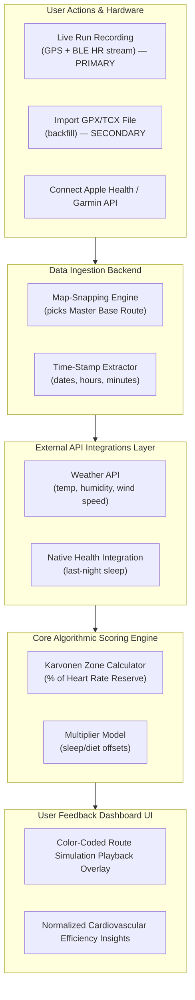

## Product Requirements Document (PRD)

## Project Name: RoutePulse (Working Title)
Target Phase: Minimum Viable Product (MVP)
Author: AI Co-Developer & Founder Collaboration
------------------------------
## 1. Product Overview & Core Value Proposition
RoutePulse is a niche fitness analytics mobile application specifically engineered for data-driven routine runners who frequently repeat the exact same geographical route.
Unlike mainstream fitness networks (e.g., Strava), which treat runs as isolated events or broad social leaderboards, RoutePulse serves as an intelligent physiological lab. By locking the geographic route as a constant variable, the app isolates and evaluates true cardiovascular adaptation, factoring in environmental stress (weather) and lifestyle recovery metrics (sleep, training gaps, and dietary habits).

The core feature is first-party live run tracking: the app records each run in real time — GPS, live heart rate, pace, and current Karvonen zone — against the runner's Master Base Route, with an optional live ghost pacer racing past efforts on the same loop. File import (GPX/TCX from Strava or smartwatches) is a secondary path, retained for backfilling historical runs and onboarding migration.

------------------------------
## 2. Target User Personas

* The Routine Runner: Individuals who possess a safe, predictable, local loop (e.g., 5km near home) that they execute weekly to maintain health.
* The Aerobic Engine Builder (Zone 2 Practitioner): Runners actively trying to transition from anaerobic exhaustion to low-heart-rate endurance, requiring clear validation of cardiovascular efficiency.

------------------------------
## 3. System Architecture & High-Level Data Flow

------------------------------
## 4. Functional Requirements & Feature Specifications

## Module 1: Live Run Tracking (The Core Capture Engine)

* FR-1.1: Live GPS Capture: The app must record the device GPS stream in real time during an active run, persisting a track point at a configurable sampling interval (default 1s) to a local buffer resilient to app backgrounding and signal loss.
* FR-1.2: Live Biometric Feed: The app must stream the runner's live Heart Rate from a connected wearable or BLE chest strap during the run, time-aligned to the GPS track for in-run Karvonen zone evaluation (reuses Module 3 HRR boundaries).
* FR-1.3: On-Run Display: The active-run screen must show live pace, distance, elapsed time, current HR, and current Karvonen zone, with a moving position marker on the Master Base Route map.
* FR-1.4: Live Route Matching: During the run, the system must continuously snap the live position to the Master Base Route (reusing the FR-2.3 map-matching matrix) and surface real-time off-route drift beyond the 15% variance threshold.
* FR-1.5: Live Ghost Pacer: The on-run display must render a "ghost" marker of a selected historical run on the same route, showing live lead/lag delta against that past effort (live counterpart of FR-5.1).
* FR-1.6: Auto-Ingestion on Finish: On run completion, the recorded track must feed directly into the ingestion pipeline (Module 2) with no manual file handling, then run normalization and scoring (Modules 3–4) automatically.

## Module 2: Data Ingestion & Route Matching (The Control Lab)

* FR-2.1: File Import (Secondary Path): In addition to live-recorded runs, the system must accept standard GPX and TCX file uploads extracted directly from Strava or smartwatches, for backfilling historical runs and onboarding migration.
* FR-2.2: Base Route Creation: The system must prompt the user to designate their first run — live-recorded or imported — as the "Master Base Route."
* FR-2.3: Algorithmic Map-Matching: Every subsequent run (live or imported) must be automatically mapped and snapped to the Master Base Route boundaries using a map-matching matrix. Gaps or alternate routes over a 15% variance threshold must be rejected or filed as a separate route profile.

## Module 3: Personalized Physiological Zone Calculation

* FR-3.1: Karvonen Core Profiling: During registration, the system must collect User Age, Weight, and Biological Sex.
* FR-3.2: Dynamic Resting Heart Rate Sync: The system must continuously fetch the user's weekly Resting Heart Rate (RHR) from connected wearbles to execute the Heart Rate Reserve (HRR) formula:

$$\text{Max HR} = 211 - (0.64 \times \text{Age})$$

$$\text{Heart Rate Reserve (HRR)} = \text{Max HR} - \text{Resting HR}$$

* FR-3.3: Zone Calibration: The app must establish hard boundaries for performance mapping:
* Zone 2 (Aerobic Base): 60% to 70% of HRR + Resting HR
   * Zone 3 (Tempo/Grey Zone): 70% to 80% of HRR + Resting HR

## Module 4: Contextual Recovery & Weather Normalization

* FR-4.1: Automated Sleep Scraping: The app must integrate natively with Apple Health and Google Connect to automatically pull the prior night's sleep duration dataset.
* FR-4.2: Automated Weather Pull: The app must extract the exact coordinate location and timestamp from the run track to fetch historical ambient temperature, humidity, and wind vectors via open-source weather APIs.
* FR-4.3: Post-Run Micro-Survey: Upon run completion, a single-tap confirmation card must appear asking the runner to toggle:
* Caffeine consumption within 2 hours? [Yes / No]
   * Heavy digestive meal within 2 hours? [Yes / No]
* FR-4.4: Stress Normalization Adjustment: If sleep falls below 6 hours or the heat index breaks past 30°C, the system must invoke a heart rate modifier model to normalize data calculations, protecting the user's ongoing historical fitness scores from acute outliers.

## Module 5: Simulation & Performance Analytics View

* FR-5.1: Ghost Route Overlays: The primary display screen must support an animated map player showing multiple historical loop runs concurrently using color-coded progress markers.
* FR-5.2: Aerobic Drift Tracking: The dashboard must visually isolate the exact milestone coordinate where a user's heart rate drifts out of Zone 2 into Zone 3 at a sustained running speed.
* FR-5.3: Estimated Metabolic Fuel Splits: The system must display a chart displaying the ratio of energy consumption derived from body fat stores versus active carbohydrates, calculated against intensity distributions across the route metrics.

------------------------------
## 5. Non-Functional Requirements (NFR)

* NFR-6.1: Privacy & Encryption: Because the application captures precise personal home-starting locations (GPX track roots) and biometric data, all user files must be encrypted via HTTPS protocols, with options to obfuscate home coordinates within a 200-meter radius.
* NFR-6.2: Offline Processing: The data calculation, file parser, and normalization equations must process locally within the device browser engine if active server networks are unavailable.
* NFR-6.3: Frictionless Access: The core micro-survey must require no more than two continuous interactive gestures (taps) to dismiss and log.

Would you like us to expand this document by writing the specific database schema (SQL table structure) that links these matching GPX tracks to the sleep logs, or should we write a sample JSON file structure that represents this unified payload?

